## Automating My README

> Using automation to keep my README updated

The below is built using my custom [build-svg.ps1](https://github.com/gribanj/gribanj/blob/main/build-svg.ps1) PowerShell script, which runs daily at 4am via this [GitHub Action](https://github.com/gribanj/gribanj/blob/main/.github/workflows/readme.yml).

 

 

---

<!-- (Add or remove any sections below to fit your content) -->

## A Bit About Me

- I’m a DevOps/SRE/Cloud Engineer.
- I love tackling new challenges and exploring technology.
- I use automation to stay on top of technical debt and free up bandwidth for innovation.

<!-- Optionally, add more personal or project info below -->
